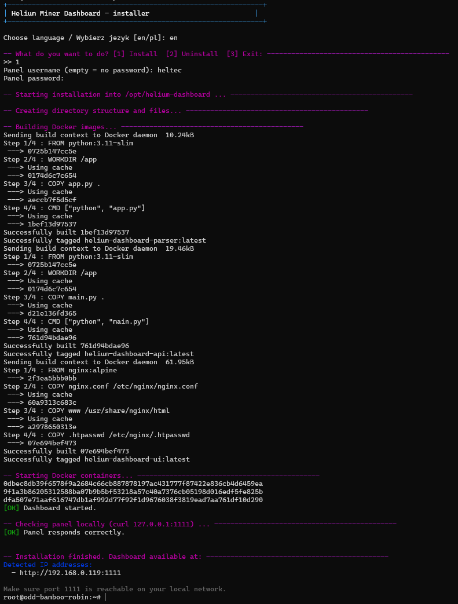
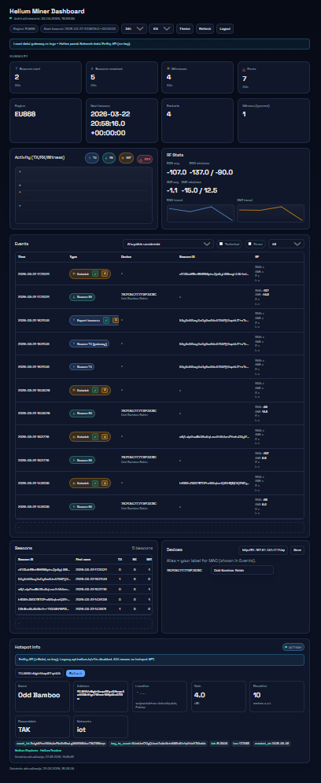
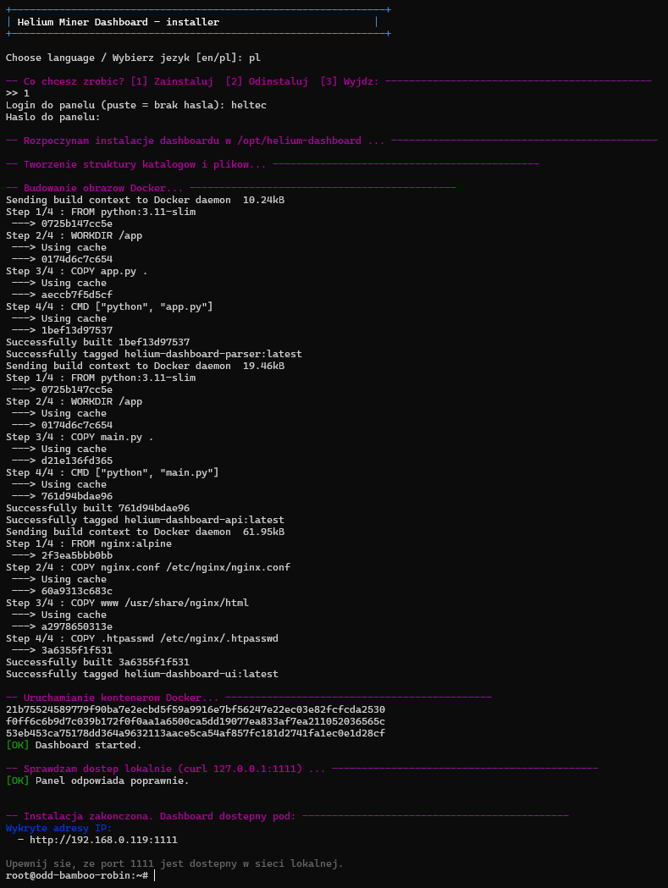
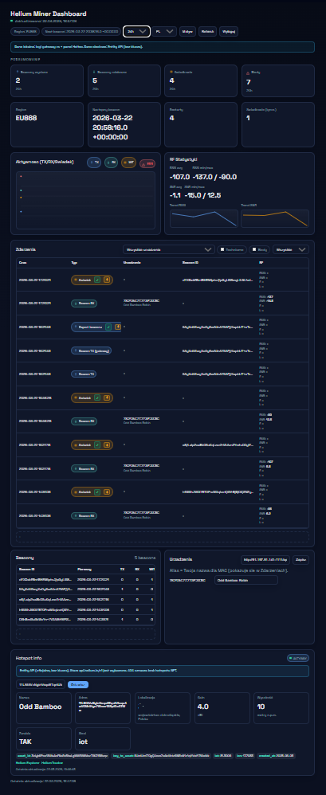

# HMD — Helium Miner Dashboards

Lightweight, self-hosted dashboards for Helium miners on different vendors.
This repository will grow with dashboards for other devices (e.g. SenseCap).

[English](#english) | [Polski](#polski)

## Contents
- `heltec/helium-dashboard.sh` — Heltec Indoor Hotspot dashboard (HT-M2808 + HT-M01S Rev.2.0 radio, or without external radio)
- `img/` — screenshots used in README

---

<a id="english"></a>
# English

## Heltec Indoor Hotspot Dashboard
Target device:
- **HT-M2808 Indoor Hotspot for Helium**
- **HT-M01S Indoor LoRa Gateway (Rev.2.0)** or without external radio

This dashboard is the **Heltec-specific** implementation inside the multi-vendor HMD repository.

### Prerequisites
- **Root access** is required to install and manage the dashboard on Heltec.
- How to obtain root on Heltec:
  - https://github.com/hattimon/miner_watchdog/blob/main/linki.md
- Related Heltec helper script (watchdog):
  - https://github.com/hattimon/miner_watchdog

### Install on Heltec (from this repo)
```bash
sudo -i
curl -fsSL https://raw.githubusercontent.com/hattimon/HMD/main/heltec/helium-dashboard.sh -o /opt/helium-dashboard.sh
chmod +x /opt/helium-dashboard.sh
/opt/helium-dashboard.sh
```

### Installation flow
1. Start the script.
2. Choose language: EN or PL.
3. Choose action: Install or Uninstall.
4. During install, enter the panel login and password.
5. The script builds Docker images and starts the stack. The panel will be available at `http://<device-ip>:1111`.

### Change login or password
Reinstall the dashboard and provide new credentials during the install flow.

### How the dashboard works
Data sources:
- Local **gateway_rs logs** from the miner container (parsed into SQLite).
- Local **Heltec panel** (`apply.php`) for device name, hotspot address, wallet, region, firmware and basic status.
- Public **Helium Entity API** for hotspot metadata (name, location, rewardable, gain, elevation).

Sections:
- **Summary**: TX/RX/Witness/Error counts, Region, Next beacon, Restarts (from logs).
- **Activity + RF**: timelines and RF stats (RSSI/SNR/Freq/Len) from logs.
- **Events**: latest parsed log events with filters and raw log line view.
- **Beacons**: grouped beacon IDs with TX/RX/WIT counters.
- **Devices**: MAC aliases stored in the browser (localStorage) and shown in Events.
- **Hotspot Info**: auto-detected address from Heltec panel + metadata from Entity API.

### Screenshots



---

<a id="polski"></a>
# Polski

## Dashboard dla Heltec Indoor Hotspot
Urządzenie docelowe:
- **HT-M2808 Indoor Hotspot for Helium**
- **HT-M01S Indoor LoRa Gateway (Rev.2.0)** lub bez zewnętrznego radia

To jest **wersja Heltec** w repozytorium HMD (docelowo dla wielu producentów).

### Wymagania
- **Wymagane jest konto root** do instalacji i zarządzania dashboardem.
- Jak uzyskać root na Heltecu:
  - https://github.com/hattimon/miner_watchdog/blob/main/linki.md
- Powiązany skrypt (watchdog) dla Helteca:
  - https://github.com/hattimon/miner_watchdog

### Instalacja na Heltecu (z tego repozytorium)
```bash
sudo -i
curl -fsSL https://raw.githubusercontent.com/hattimon/HMD/main/heltec/helium-dashboard.sh -o /opt/helium-dashboard.sh
chmod +x /opt/helium-dashboard.sh
/opt/helium-dashboard.sh
```

### Przebieg instalacji
1. Uruchom skrypt.
2. Wybierz język: EN lub PL.
3. Wybierz akcję: Instaluj lub Odinstaluj.
4. Podczas instalacji podaj login i hasło do panelu.
5. Skrypt zbuduje obrazy Dockera i uruchomi stack. Panel będzie dostępny pod `http://<ip-urzadzenia>:1111`.

### Zmiana loginu lub hasła
Wystarczy ponownie zainstalować dashboard i podać nowe dane w trakcie instalacji.

### Jak działa dashboard
Źródła danych:
- Lokalne **logi gateway_rs** z kontenera minera (parsowane do SQLite).
- Lokalny **panel Heltec** (`apply.php`) dla nazwy urządzenia, adresu hotspota, portfela, regionu i stanu.
- Publiczne **Helium Entity API** dla metadanych hotspota (nazwa, lokalizacja, rewardable, gain, wysokość).

Sekcje:
- **Podsumowanie**: TX/RX/Świadkowie/Błędy, Region, Następny beacon, Restarty (z logów).
- **Aktywność + RF**: wykresy i statystyki RF (RSSI/SNR/Freq/Len) z logów.
- **Zdarzenia**: ostatnie zdarzenia z logów, filtry i podgląd surowej linii.
- **Beacony**: grupowanie po beacon_id i liczniki TX/RX/WIT.
- **Urządzenia**: aliasy MAC zapisywane w przeglądarce (localStorage) i widoczne w Zdarzeniach.
- **Hotspot Info**: adres hotspota wykrywany z panelu Heltec + metadane z Entity API.

### Zrzuty ekranu


